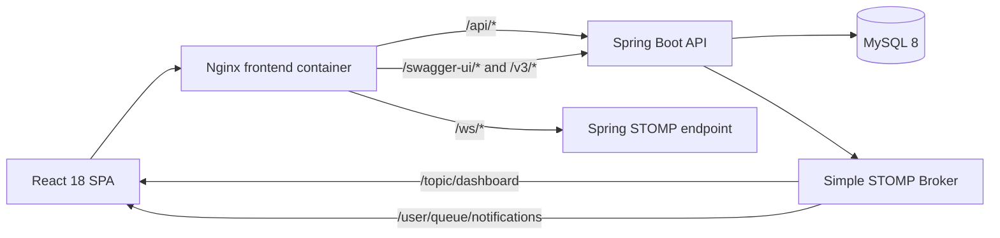
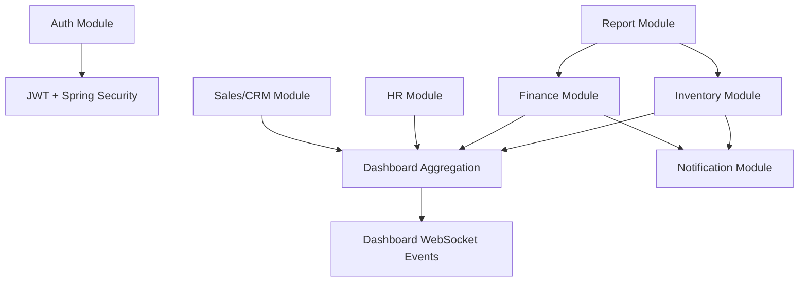
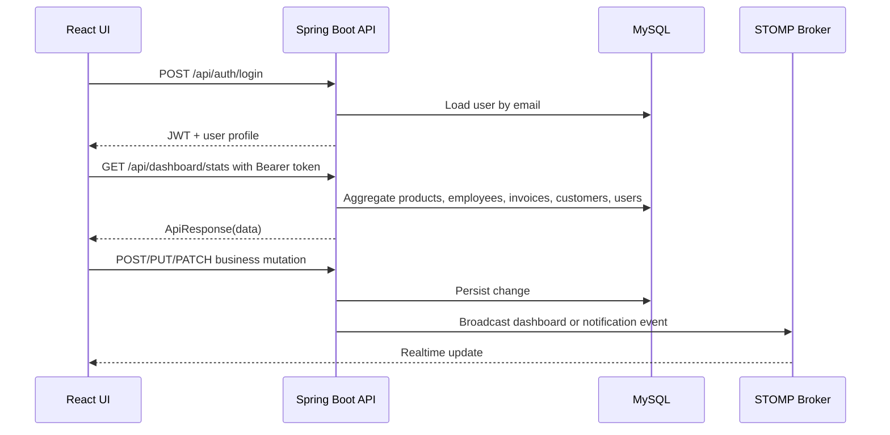
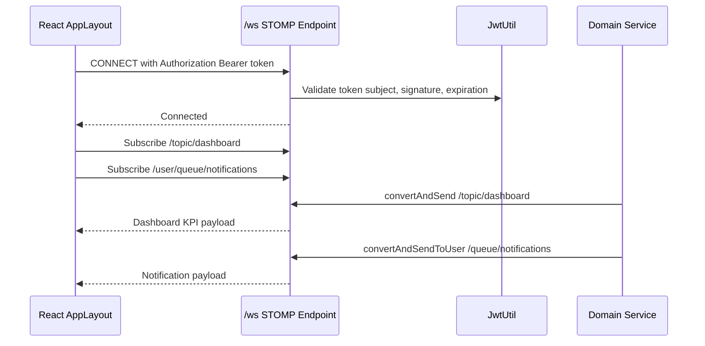
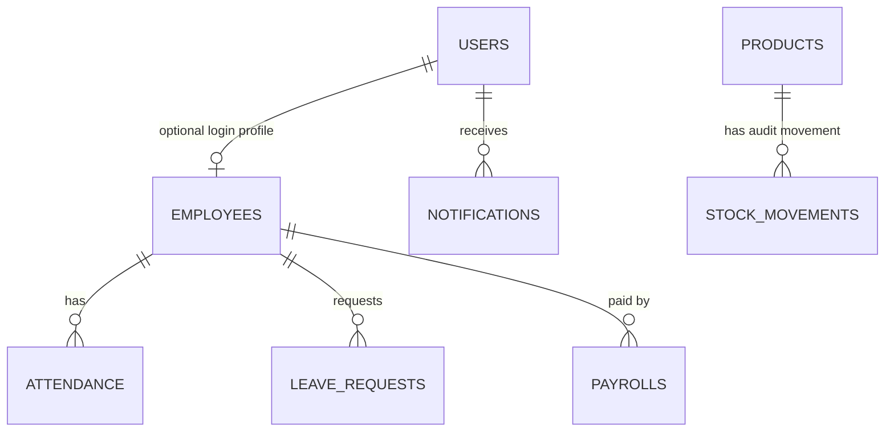

# ThunderCore ERP

ThunderCore ERP is a full-stack enterprise resource planning platform for inventory, HR, finance, sales/CRM, reports, realtime dashboard updates, and user notifications.

It is designed as an HR/interview-ready demonstration project with a Spring Boot backend, React frontend, JWT authentication, STOMP WebSockets, MySQL, Docker Compose, and Nginx.

## Runtime URLs

| Service | URL / Port |
| --- | --- |
| Frontend | http://localhost |
| Backend API through Nginx | http://localhost/api |
| Backend direct host port | http://localhost:18080 |
| Swagger / OpenAPI | http://localhost/swagger-ui.html |
| OpenAPI JSON | http://localhost/v3/api-docs |
| WebSocket SockJS endpoint | http://localhost/ws |
| MySQL host port | localhost:3307 |
| MySQL container port | mysql:3306 |

Default demo login:

| Email | Password | Role |
| --- | --- | --- |
| admin@thundercore.com | Admin@123 | SUPER_ADMIN |

## Architecture





## Backend Modules

| Module | Main Package | Responsibility |
| --- | --- | --- |
| Authentication | `auth` | Login, registration, user persistence, JWT, RBAC |
| Inventory | `inventory` | Product CRUD, stock levels, low-stock alerts |
| HR | `hr` | Employee records, user linkage, base salary/status |
| Finance | `finance` | Invoice CRUD, tax/net calculation, revenue, overdue alerts |
| Sales/CRM | `sales` | Customer CRUD and tier tracking |
| Dashboard | `dashboard` | Cross-module KPI aggregation and live broadcasts |
| Notifications | `notification` | Persisted inbox alerts and STOMP user queues |
| Reports | `report` | Excel inventory and PDF invoice exports |
| WebSocket | `websocket` | STOMP endpoint and JWT CONNECT authentication |
| Common | `common` | API response envelope and global exception mapping |

## Frontend Modules

| Path | Responsibility |
| --- | --- |
| `src/context/AuthContext.jsx` | Restores/stores JWT session state and user profile |
| `src/api/axiosConfig.js` | Adds Bearer tokens and handles 401 redirects |
| `src/components/ProtectedRoute.jsx` | Blocks protected pages until authenticated |
| `src/layouts/AppLayout.jsx` | Navigation shell, logout, notification bell, STOMP subscriptions |
| `src/pages/Dashboard.jsx` | KPI cards and Chart.js visual analytics |
| `src/pages/Inventory.jsx` | Product CRUD and low-stock status |
| `src/pages/HR.jsx` | Employee CRUD and department summary |
| `src/pages/Finance.jsx` | Invoice CRUD/status and revenue KPI |
| `src/pages/Sales.jsx` | Customer CRUD and tier summary |
| `src/pages/Reports.jsx` | Excel/PDF binary downloads |

## API Flow



All JSON business APIs use:

```json
{
  "success": true,
  "message": "Operation message",
  "data": {}
}
```

Binary report endpoints return raw bytes with download headers.

## JWT Authentication Flow

1. The user submits email/password to `POST /api/auth/login`.
2. `AuthController` authenticates through Spring Security's `AuthenticationManager`.
3. `CustomUserDetailsService` loads the user by email and maps the stored role to `ROLE_*`.
4. `JwtUtil` signs a JWT with the user email as subject and a one-day expiration.
5. React stores the token and user profile in `localStorage` through `AuthContext`.
6. `axiosConfig.js` attaches `Authorization: Bearer <token>` to API calls.
7. `JwtFilter` validates every protected request and sets the Spring Security context.
8. Controller methods use `@PreAuthorize` for role-protected mutations.

## WebSocket Event Flow



Dashboard broadcasts are emitted after product, invoice, employee, and customer changes. Notification broadcasts are emitted for low-stock products and overdue invoices.

## Database Relationships



Core runtime tables:

| Table | Purpose |
| --- | --- |
| `users` | Login identities, BCrypt passwords, roles, active state |
| `products` | Inventory catalog, stock quantity, reorder threshold |
| `employees` | HR employee profiles and base salary/status |
| `customers` | CRM accounts and customer tiers |
| `invoices` | Finance records, payment status, tax/net amounts |
| `notifications` | Persisted user alerts for the notification bell |

Extension-ready tables in `database/schema.sql` document attendance, leave, payroll, and stock movement relationships.

## Docker Deployment

Required files:

| File | Purpose |
| --- | --- |
| `.env` | Ports, database credentials, JWT secret, optional mail settings |
| `docker-compose.yml` | MySQL, backend, frontend services and health checks |
| `backend/Dockerfile` | Multi-stage Maven build and Java runtime image |
| `frontend/Dockerfile` | Vite build and Nginx static/proxy image |
| `frontend/nginx.conf` | SPA routing, API proxy, Swagger proxy, WebSocket proxy |
| `database/schema.sql` | MySQL schema and seed data for new volumes |

Start the full stack:

```powershell
cd "C:\Users\DELL\Downloads\thunder core project\thunder core project\thunder core project\thundercore-erp"
docker compose up -d --build
docker compose ps
```

Stop without deleting data:

```powershell
docker compose down
```

Reset database volume and rerun schema seed:

```powershell
docker compose down -v
docker compose up -d --build
```

## Local Development

Backend with H2 dev profile:

```powershell
cd backend
mvn clean test
mvn spring-boot:run -Dspring-boot.run.profiles=dev
```

Frontend with Vite proxy:

```powershell
cd frontend
npm install
npm run dev
```

Open http://localhost:5173.

## Verification Commands

Backend:

```powershell
cd backend
mvn clean test
mvn clean package
```

Frontend:

```powershell
cd frontend
npm install
npm run build
```

Docker:

```powershell
docker compose up -d --build
docker compose ps
```

API smoke test:

```powershell
$body = @{ email = "admin@thundercore.com"; password = "Admin@123" } | ConvertTo-Json
$login = Invoke-RestMethod -Uri "http://localhost/api/auth/login" -Method POST -Body $body -ContentType "application/json"
$headers = @{ Authorization = "Bearer $($login.token)" }

Invoke-RestMethod -Uri "http://localhost/api/dashboard/stats" -Headers $headers
Invoke-RestMethod -Uri "http://localhost/api/inventory/products" -Headers $headers
Invoke-WebRequest -Uri "http://localhost/api/reports/inventory/excel" -Headers $headers -OutFile "inventory-report.xlsx"
Invoke-WebRequest -Uri "http://localhost/api/reports/invoices/pdf" -Headers $headers -OutFile "invoice-report.pdf"
```

## Screenshot Placeholders

Add screenshots here for HR/interview walkthroughs:

| Screen | Placeholder |
| --- | --- |
| Login | `docs/screenshots/login.png` |
| Dashboard | `docs/screenshots/dashboard.png` |
| Inventory | `docs/screenshots/inventory.png` |
| Finance | `docs/screenshots/finance.png` |
| Notification Bell | `docs/screenshots/notifications.png` |
| Reports | `docs/screenshots/reports.png` |

## Troubleshooting

### Docker port conflicts

Symptoms: Compose fails with "port is already allocated".

Fix:

```powershell
notepad .env
```

Change one of:

```env
FRONTEND_HOST_PORT=8088
BACKEND_HOST_PORT=18081
MYSQL_HOST_PORT=3308
```

Then rerun:

```powershell
docker compose up -d --build
```

### MySQL connection issues

Symptoms: backend waits, exits, or logs JDBC connection errors.

Fixes:

```powershell
docker compose ps
docker compose logs mysql
docker compose logs backend
```

If the schema or credentials are stale, reset the volume:

```powershell
docker compose down -v
docker compose up -d --build
```

### JWT token issues

Symptoms: API returns 401, UI redirects to login, WebSocket does not connect.

Fixes:

- Log out and sign in again.
- Confirm `.env` has `JWT_SECRET`.
- Confirm backend logs do not show JWT parsing errors.
- Clear browser localStorage for `token` and `user`.

### CORS issues

Symptoms: browser blocks API calls during local development.

Fixes:

- Use `npm run dev` and call `http://localhost:5173`, not the backend directly.
- Confirm Vite proxy targets `http://localhost:8080`.
- In Docker, access the app through the frontend/Nginx origin.

### WebSocket failures

Symptoms: sidebar shows "Connecting..." or notifications do not arrive live.

Fixes:

- Confirm `/ws` is proxied by Nginx.
- Confirm the browser has a valid JWT after login.
- Check backend logs for STOMP CONNECT rejection.
- Verify `docker compose ps` shows backend healthy.

### Frontend build failures

Symptoms: `npm run build` fails.

Fixes:

```powershell
cd frontend
npm install
npm run build
```

If dependencies are corrupted:

```powershell
Remove-Item -Recurse -Force node_modules
npm install
```

### Backend startup failures

Symptoms: Spring Boot exits during startup.

Fixes:

```powershell
cd backend
mvn clean test
mvn spring-boot:run -Dspring-boot.run.profiles=dev
```

Check `application-prod.yml` datasource values when running with MySQL.

### npm dependency conflicts

Symptoms: npm reports dependency resolution errors.

Fixes:

```powershell
cd frontend
npm install
npm audit fix
```

Use `npm ci` for reproducible Docker builds from `package-lock.json`.

### Maven dependency conflicts

Symptoms: Maven cannot resolve or compile dependencies.

Fixes:

```powershell
cd backend
mvn -U clean test
mvn dependency:tree
```

Confirm Java 17 is active:

```powershell
java -version
```

## Production Notes

- Rotate all default secrets and passwords before public deployment.
- Keep `JWT_SECRET` at least 32 bytes of strong random material.
- Restrict CORS origins for non-demo environments.
- Use managed MySQL backups for production data.
- Serve HTTPS at the load balancer or reverse proxy layer.
- Keep Docker health checks enabled so dependent services start in order.

===================================================
output commends line

# GO TO PROJECT FOLDER

cd "C:\Users\DELL\Downloads\thunder core project\thunder core project\thunder core project\thundercore-erp"

# START DOCKER CONTAINERS

docker compose up -d --build

# SHOW CONTAINER STATUS

docker compose ps

# PRINT LOGIN PAGE URL

Write-Host ""
Write-Host "======================================="
Write-Host " THUNDERCORE ERP LOGIN PAGE "
Write-Host "======================================="
Write-Host ""

Write-Host "Frontend Login URL:"
Write-Host "http://localhost"

Write-Host ""
Write-Host "Swagger URL:"
Write-Host "http://localhost/swagger-ui.html"

Write-Host ""
Write-Host "Backend URL:"
Write-Host "http://localhost:18080"

Write-Host ""
Write-Host "DEFAULT LOGIN"
Write-Host "Email: [admin@thundercore.com](mailto:admin@thundercore.com)"
Write-Host "Password: Admin@123"

Write-Host ""
Write-Host "======================================="
Write-Host " SYSTEM RUNNING SUCCESSFULLY "
Write-Host "======================================="


======================================================
output
backend:
cd "C:\Users\DELL\Downloads\thunder core project\thunder core project\thunder core project\thundercore-erp\backend"
mvn spring-boot:run "-Dspring-boot.run.profiles=dev"

=================
Frontend:
cd "C:\Users\DELL\Downloads\thunder core project\thunder core project\thunder core project\thundercore-erp\frontend"
npm run dev

=====================
open 3 rd terminal 
::
# Test backend health
Invoke-RestMethod "http://localhost:8080/actuator/health"

# Test login
$body = '{"email":"admin@thundercore.com","password":"Admin@123"}'
$login = Invoke-RestMethod -Uri "http://localhost:8080/api/auth/login" -Method POST -Body $body -ContentType "application/json"
Write-Host "Login OK: $($login.email) | Role: $($login.role) | Token: $($login.token.Substring(0,30))..."
